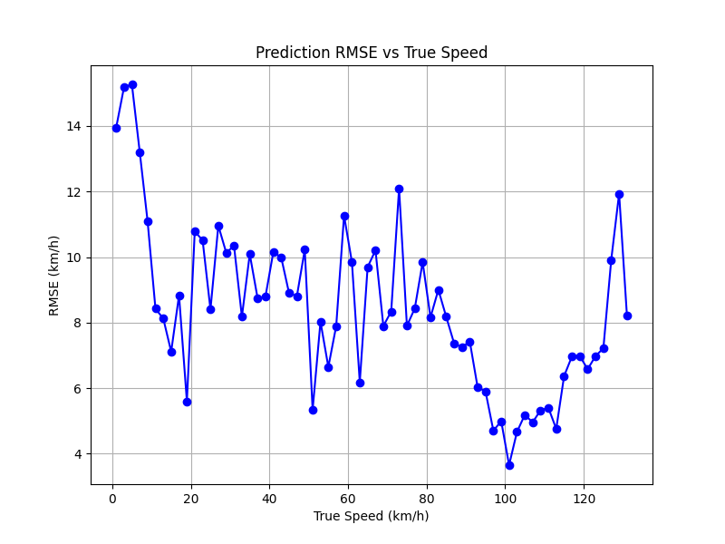
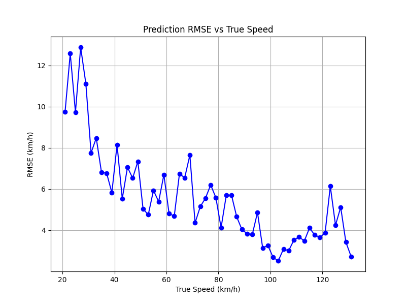

# DS3273-IVP

**Name**: Vignesh M Pai

**Roll Number**: 20211132

## Problem Description

Dash cam footage is increasingly an invaluable component in preventing traffic accidents and training self driving cars.

Dash cam footage can be parsed through an AI pipeline to determine when to break a vehicle, be cautious of surroundings, or detect traffic signs. A stepping stone to these goals is the simple task of detecting the speed of the vehicle through its dash cam footage.

This project builds a model that uses a small number of frames around a time from the video to estimate the speed of the vehicle. The construction of these frames is acheived through preprocessing that also resizes the frames and converts them to grayscale.

The CNN has the following attributes

**Input**: An array of shape `(1, N, HEIGHT, WIDTH)` where `N` is the number of frames in the clip.

**Output**: The estimated speed of the vehicle (normalized using mean and standard deviation of the training set) during the clip.

### Data Source

The model was trained on the [comma2k19](https://github.com/commaai/comma2k19) dataset. In particular, only `Chunk_1` of the dataset was utilized. The dataset can be downloaded from [here](https://huggingface.co/datasets/commaai/comma2k19).

## Model Architecture

The model was trained on 3 consecutive 3D convolution and 3D pooling layers, followed by a dropout layer and 2 linear layers.
`ReLU` activation function was used.
The model was trained with the Adam optimizer with a manually varying learning rate and a `SmoothL1Loss` loss function (the standard `MSE` loss function was equally performant).

## Benchmarks and Results

Note that low speeds and high speeds are distinctly different regimes in traffic.
Further, the dataset contained more data at higher speeds than lower speeds (except at 0, when the vehicle was stationary) and the data at lower speeds is inherently noisy, requiring a more complex network. Due to this separation, the model did not perform well at low speeds when trained on the entire dataset, but performed very well at higher speeds with satisfactory performance at medium speeds as the graph below illustrates.

_Note_: the spike after 120 km/h is due to small number of data points while the spike near 0 km/h is due to the differences in the regime of low and high speeds.

Using the above observations, another model was trained on a subdataset by discarding clips with speeds below 20 km/h (these could be captured by a more complex pipeline).
This gave a significant improvement to the predictions for medium and high speeds.

## Installation

The requirements can be installed using `pip install -r requirements.txt`. It is assumed that `Chunk_1` is at the root of this repository, Example data is provided in `data/`.
